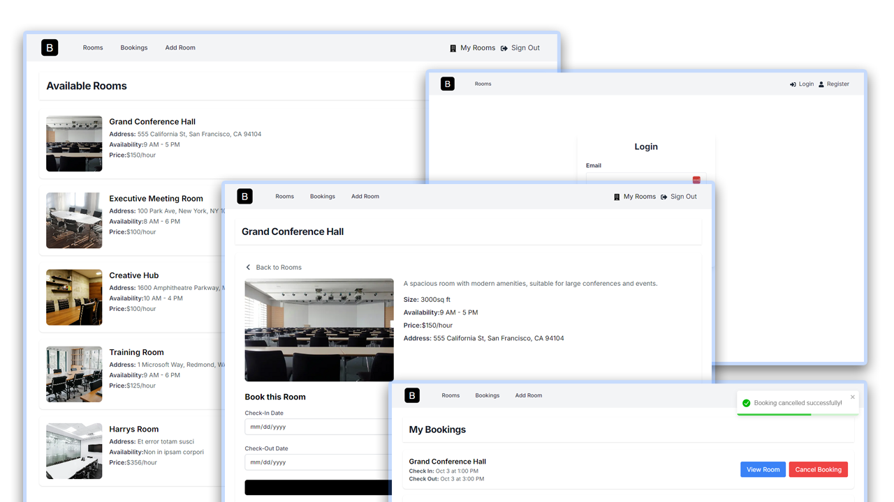

# Bookit App

Meeting room booking application built with Next.js, Appwrite, and Tailwind CSS.


The "_theme_files" folder contains the UI and HTML files only.

## Usage

#### Install Dependencies

```bash
npm install
```

#### Run the development server:

```bash
npm run dev
```

Open [http://localhost:3000](http://localhost:3000) with your browser.

#### Appwrite Setup & Environment Variables

you will need to create a new project and database in Appwrite.

Log into your [https://cloud.appwrite.io/console](Appwrite console) and setup your project. Rename the `.env.example` file to `.env.local` and add your own values for the Appwrite API key, project ID and database ID environment variables.
